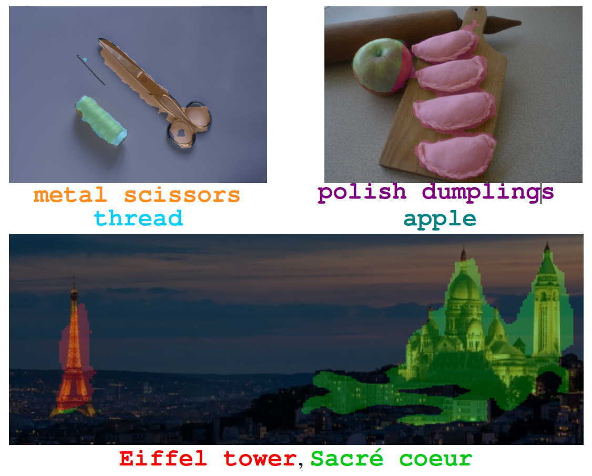

<div align="center">
<h2>
CLIP-DIY: CLIP Dense Inference Yields Open-Vocabulary Semantic
Segmentation For-Free <br>
<p></p>

<a href="https://wysoczanska.github.io/">Monika Wysoczańska</a>&ensp;
<a href="https://github.com/jake-austin">Michael Ramamonjisoa</a>&ensp;
<a href="http://staff.ii.pw.edu.pl/~ttrzcins/">Tomasz Trzciński</a>&ensp;
<a href="https://osimeoni.github.io/">Oriane Siméoni</a>&ensp;

<p></p>
<a href="https://arxiv.org/pdf/2309.14289.pdf"></a>
<p></p>



</h2>
</div>

Official PyTorch implementation of [**CLIP-DIY: CLIP Dense Inference Yields Open-Vocabulary Semantic Segmentation For-Free**](https://arxiv.org/abs/2309.14289).

This repository contains:

- scripts to download and load datasets
- script to extract FOUND saliency
- evaluation pipeline to reproduce quantitative results
- jupyter notebook DEMO

This repository does NOT contain:

- training code and checkpoints (since our method is training-free 🕊️)

```
@article{wysoczanska2023clipdiy,
  title={CLIP-DIY: CLIP Dense Inference Yields Open-Vocabulary Semantic Segmentation For-Free},
  author={Wysocza{\'n}ska, Monika and Ramamonjisoa, Micha{\"e}l and Trzci{\'n}ski, Tomasz and Sim{\'e}oni, Oriane},
  journal={arXiv preprint arXiv:2309.14289},
  year={2023}
}
```

## Installation 

### 1. Create conda environment

```
conda env create -f environment.yml
conda activate py39
```

### 2. Download datasets 

```
python scripts/download_coco.py
python scripts/download_pascal.py
```

The scripts are taken from the [COMUS](https://github.com/zadaianchuk/comus) codebase. Thanks to the authors!

### 3. Download [FOUND](https://valeoai.github.io/blog/publications/found/)
```
cd thirdparty
git clone https://github.com/valeoai/FOUND.git
```

## Run our demo!

Our demo is available in demo.ipynb jupyter notebook - Have fun!

## Run evaluation

### 1. Extract FOUND saliency

To run our evaluation we first need to extract saliency results by running FOUND inference:

```
cd thirdparty
python extract_saliency.py --img-dir [COCO_ROOT]/images/val2017/ --output-dir coco_saliency --drop-probs # for COCO Object
python extract_saliency.py --img-dir [PASCAL_ROOT]/images/JPEGImages/ --output-dir pascal_saliency --drop-probs # for PASCAL VOC
```

### 2. Reproduce qualitative results 

Once you've obtained saliency maps for both datasets you can run our evaluation script:

```
python eval_clipconv.py [config filename in configs directory]
python eval_clipconv.py cfg_clip_coco.yaml # for COCO Object
```

## Credits

Thanks to the authors of the following repositories that served as a codebase!

- [COMUS: Zadaianchuk et al. "Unsupervised Semantic Segmentation with Self-supervised Object-centric Representations"](https://github.com/zadaianchuk/comus)
- [FOUND: Simeoni et al. "Unsupervised Object Localization: Observing the Background to Discover Objects"](https://valeoai.github.io/blog/publications/found/)
